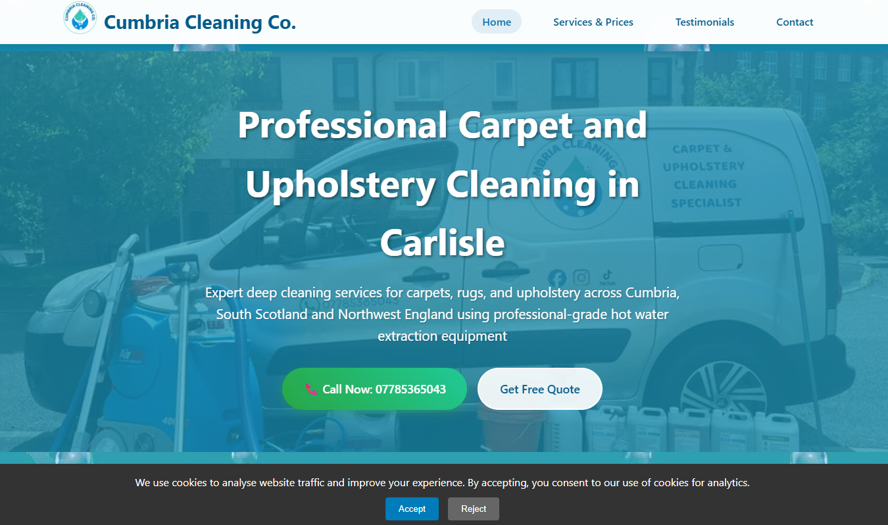
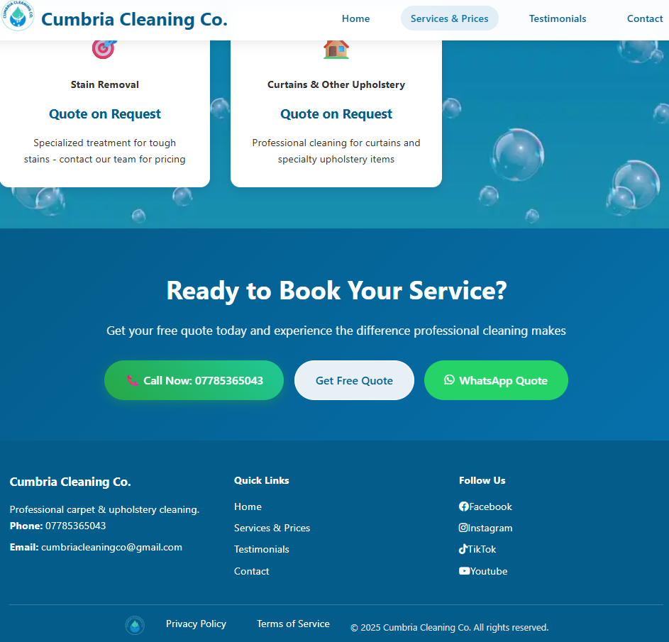

📝 Description
This project is the official website for Cumbria Cleaning Co., a local cleaning service based in Cumbria, UK. The website was designed and developed to establish a professional online presence for the company, providing potential customers with essential information about their services, pricing, and contact options.

The site aims to enhance the company's visibility and streamline customer inquiries by offering clear navigation and direct communication channels.

🌟 Key Features
Comprehensive Service List: Detailed breakdown of cleaning services offered.

Transparent Price List: Clear and accessible pricing information for various services.

Client Testimonials Page: Dedicated section showcasing positive reviews from satisfied customers, building trust and credibility.

Direct Contact Options:

Contact Form: A user-friendly form for direct inquiries.

mailto: Link: Quick email access for general questions/quotes.

WhatsApp Link: Instant communication channel for immediate inquiries.

Responsive Design: Ensures optimal viewing experience across various devices (desktops, tablets, and mobile phones) through optimized CSS.

Essential Site Files: Includes sitemap.xml for SEO and robots.txt for crawler instructions, ensuring the site is discoverable and properly indexed.

Privacy Policy & Terms of Service: Dedicated pages for legal compliance and transparency.

🚀 Live Demo
You can view the live website here: https://cumbriacleaningco.co.uk/

🛠️ Technologies Used
HTML5: For structuring the content of the website.

CSS3: For styling and ensuring a responsive and visually appealing design.

Basic JavaScript: For cookie consent, sidebar navigation and contact form.

SEO Best Practices: Implementation of sitemap.xml and robots.txt.

📁 Project Structure

'''bash
.
├── images/                     # Directory for various images and logos used throughout the site
├── css/                        # Stylesheet directory
│   └── styles.css              # Main stylesheet for the website's design
├── pages/                      # Directory for individual content pages
│   ├── privacy-policy.html     # Page detailing the company's privacy policy
│   ├── services.html           # Page outlining the cleaning services offered
│   ├── terms-of-service.html   # Page for terms and conditions
│   └── testimonials.html       # Page showcasing customer reviews
├── favicon.ico                 # Standard favicon
├── favicon-*.ico               # Multiple favicon versions for different browser compatibility
├── CNAME                       # Custom domain configuration file for GitHub Pages
├── index.html                  # The main landing page of the website
├── robots.txt                  # Instructions for web crawlers (e.g., search engines)
├── sitemap.xml                 # XML sitemap to help search engines crawl the site
└── site.webmanifest            # Web app manifest for progressive web app features
'''

💡 What I Learned
Client Communication: Gaining experience in translating client requirements into a functional web presence.

Front-end Development: Solidifying skills in HTML and CSS for building clean, semantic, and responsive layouts.

User Experience (UX) Design: Focusing on intuitive navigation and clear calls-to-action for visitors.

Basic SEO Principles: Understanding the importance of meta tags, page structure, sitemaps and robots.txt for search engine visibility.

Cross-Browser Compatibility: Ensuring consistent appearance and functionality across different web browsers.

📞 Contact
For any questions or feedback regarding this project, please feel free to open an issue in this repository.
